  

  
  
  
  
  

 

  
  
  
  
  
  
  
  
  
  
  
  
  
  
  
  
  
  
  
  
  
  
  
  

 

  

 

  
  

  <!-- stats-generated -->Generated: Week 33, 2026<!-- /stats-generated -->

 

  

 

  

 

  

